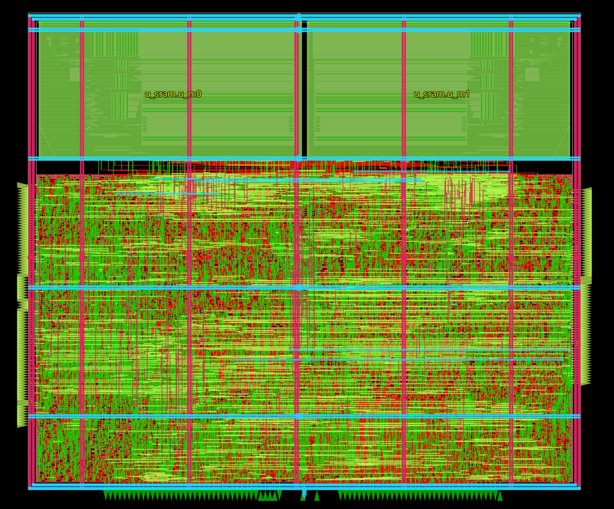

# 4×4 Systolic Array Accelerator

<p align="center"> </p>

A matrix-multiply accelerator on SkyWater 130nm (`sky130_fd_sc_hd`), taken from RTL to a
signed-off GDS with LibreLane / OpenROAD.

**Closed at 200 MHz (5 ns) with zero violations.**

| | |
|---|---|
| Clock | 5.00 ns — 200 MHz |
| Setup / hold worst slack | +0.054 ns / +0.074 ns (`max_ss_100C_1v60`) |
| Max slew / max cap | 0 / 0 |
| Antenna / DRC / LVS | 0 / 0 / 0 |
| Die | 758.08 × 654.52 µm |
| Instances | 49,694 (27,098 std cells) |
| Utilization | 82% |
| Power | 69.6 mW |

Signoff is checked across all 9 corners.

## Design

- **4×4 PE array** — Wallace-tree multipliers with carry-save adders; partial sums stay in
  redundant form through the array and resolve once at the edge.
- **AXI4 master** for DMA in and results out; **AXI4-Lite slave** for control/status registers.
- **Two 64×32 SRAM macros** (`sram22_64x32m4w8`) as ping-pong tile buffers.
- Auto-fill and auto-store keep the array fed without CPU round-trips.

```sh
rtl/
  top.sv              # top level
  systolic_array.sv   # the 4×4 array
  pe.sv, csa.sv       # processing element, carry-save adder
  array_control.sv    # tile sequencing, SRAM addressing
  sys_ctrl.sv         # run control, pointers, status
  axi_lite_csr.sv     # CSR block
  axi4_dma.sv         # read DMA
  axi4_dma_wr.sv      # write DMA
  res_cap_fifo.sv     # result capture FIFO
  pp_buf_sram.sv      # ping-pong SRAM wrapper
final_run/            # contains the final PnR database and reports
```

## Build

```bash
make lint                     # verilator
make cocotb                   # RTL simulation
python flow.py --tag <name>   # full PnR
```

After a run:

```bash
make gl RUN=<tag>             # gate-level simulation
make report RUN=<tag>         # run report
make sta-corners RUN=<tag>    # per-corner timing
```

`flow.py` is the entry point for PnR — **not** the `librelane` CLI, which silently drops
the project's `Custom.*` steps.

Useful flags:

```bash
python flow.py --tag <name> --rerun-from <Step> --from <Step>   # resume a run
```

## Flow customizations

- **`Custom.CTS`** (`steps.py`, `scripts/openroad/cts.tcl`) — adds `-no_insertion_delay`
  and `-dont_use_dummy_load`, which stock LibreLane never passes. Stops CTS padding 2,781
  registers to line up with 2 slow SRAM clock pins.
- **`Odb.InsertECOBuffers`** — inserted before detailed routing. The last 45 buffers that
  close timing are listed in `config.json` under `INSERT_ECO_BUFFERS`.

> **Note:** `INSERT_ECO_BUFFERS` targets tool-generated instance names from this specific
> database. It is correct on a resumed run. Delete the block before starting a run from
> synthesis, then re-derive the list from the new run's reports.

