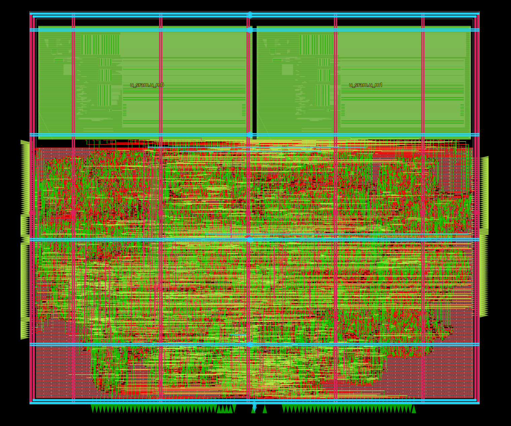

# sky130 4×4 INT8 Systolic Matrix-Multiply Accelerator



Weight-stationary **4×4 INT8 matrix-multiply accelerator** implemented from RTL to GDSII using **LibreLane** and the **Sky130A** PDK.

* AXI4-Lite control interface
* 2× AXI4 master DMA interfaces
* Ping-pong SRAM input buffer
* 4×4 systolic PE array
* 2-stage MAC pipeline
* 18-bit exact partial-sum output

## Architecture

```text
top
├── reset_sync_2ff        async-assert / sync-release reset
├── axi_lite_csr          AXI4-Lite slave
├── axi4_dma              AXI4 master read, operand fetch
├── axi4_dma_wr           AXI4 master write, result store
├── pp_buf_sram           ping-pong operand buffer
│   └── sram_rst_rel      staged SRAM reset release
├── array_control         job sequencer and tile control
├── systolic_array        4×4 PE grid
│   └── pe                2-stage MAC, registered product
└── res_cap_fifo          18-bit result packer
```

The array is weight-stationary:

* B is loaded into the PE registers and remains stationary.
* A streams into the array from the left.
* Partial sums propagate downward.
* The array uses a pipelined valid wavefront rather than an FSM.

## Repository Layout

```text
rtl/                SystemVerilog RTL
tb/                 cocotb + SystemVerilog testbenches
constraints/        PnR and signoff SDC files
scripts/            SRAM, STA, PDN and reporting utilities
sram22_64x32m4w8/   SRAM macro views
config.json         LibreLane configuration
Makefile            Build and flow entry points
image.png           Final routed layout image
run_final_dir/      Complete final LibreLane run directory
└── final/          Final run artifacts and reports
```

`run_final_dir/final/` contains the files generated by the final physical-design run, including the final layout, netlists, timing reports, extracted data, and other signoff artifacts.

## Register Map

AXI4-Lite, 32-bit registers:

| Offset | Name       | Access | Description                               |
| ------ | ---------- | ------ | ----------------------------------------- |
| `0x00` | `CTRL`     | RW     | EN, GO, LOAD_W, STORE, AUTO_ST, AUTO_FILL |
| `0x04` | `STATUS`   | RO     | DMA, array, FIFO and result status        |
| `0x08` | `SRC_ADDR` | RW     | Operand fetch base address                |
| `0x0C` | `LEN`      | RW     | Operand length                            |
| `0x10` | `RESULT`   | RO     | Result FIFO, pop-on-read                  |
| `0x14` | `DST_ADDR` | RW     | Result store base address                 |
| `0x18` | `NJOBS`    | RW     | Number of jobs                            |

Tile results are stored as exact **18-bit partial sums**. For `K > MATRIX_SIZE`, software accumulates results across tiles.

## Simulation

Install the Python simulation dependencies:

```bash
make venv
```

Run the main checks:

```bash
make lint
make cocotb
make vectors
make xrun
```

* `make lint` — Verilator lint
* `make cocotb` — primary cocotb regression
* `make vectors` — regenerate stimulus and golden vectors
* `make xrun` — SystemVerilog simulation

## Physical Design

Build the SRAM macro views first:

```bash
make sram
```

Run/report physical-design results:

```bash
make report RUN=<tag>
make sta-shell RUN=<tag> CORNER=max_ss_100C_1v60
make lib-last_run
make gl RUN=<tag>
```

The project uses the Sky130A PDK from Volare by default:

```text
PDK_ROOT ?= $(HOME)/eda/.volare
```

The LibreLane configuration uses a **10 ns clock period** with explicit PnR and signoff SDC files.

## Final Run

The final physical-design artifacts are stored in:

```text
run_final_dir/final/
```

This directory is the reference output of the final run and contains the generated implementation and signoff artifacts.

The final routed layout is:

```text
run_final_dir/final/...
```

The repository also includes the routed-layout image shown above.

## Signoff

**Target:** 10 ns / 100 MHz
**Corners:** 9
**Parasitics:** extracted

| Metric              |         Result |
| ------------------- | -------------: |
| Worst setup slack   | **+0.5798 ns** |
| Worst hold slack    | **+0.1522 ns** |
| Setup violations    |          **0** |
| Hold violations     |          **0** |
| Max-cap violations  |          **0** |
| Max-slew violations |          **6** |
| Magic DRC           |          **0** |
| KLayout DRC         |          **0** |
| Routing DRC         |          **0** |
| LVS                 |          **0** |
| Antenna             |          **0** |
| GDS XOR             |          **0** |

### Timing by Corner

| Corner             |       Setup WS |        Hold WS | Max Slew |
| ------------------ | -------------: | -------------: | -------: |
| `nom_tt_025C_1v80` |     +3.5225 ns |     +0.2818 ns |        0 |
| `nom_ss_100C_1v60` |     +0.6678 ns |     +0.5310 ns |        4 |
| `nom_ff_n40C_1v95` |     +3.9878 ns |     +0.1537 ns |        0 |
| `min_tt_025C_1v80` |     +3.5533 ns |     +0.2814 ns |        0 |
| `min_ss_100C_1v60` |     +0.7653 ns |     +0.5218 ns |        3 |
| `min_ff_n40C_1v95` |     +4.0074 ns |     +0.1555 ns |        0 |
| `max_tt_025C_1v80` |     +3.4913 ns |     +0.2821 ns |        0 |
| `max_ss_100C_1v60` | **+0.5798 ns** |     +0.5411 ns |        6 |
| `max_ff_n40C_1v95` |     +3.9689 ns | **+0.1522 ns** |        0 |

## Physical Results

| Metric                    |             Result |
| ------------------------- | -----------------: |
| Die area                  |        502,425 µm² |
| Die dimensions            | 758.08 × 662.76 µm |
| Core area                 |        470,451 µm² |
| Utilisation               |              69.0% |
| Instances                 |             57,050 |
| Sequential cells          |              2,120 |
| Buffers                   |              1,303 |
| Timing-repair buffers     |                922 |
| Clock buffers / inverters |          381 / 151 |
| Clock gates               |                 51 |
| Antenna diodes            |                329 |
| SRAM macros               |                  2 |
| Total power               |            11.9 mW |
| Wirelength                |         528,547 µm |
| Vias                      |            127,033 |
| Worst / average IR drop   | 0.781 mV / 65.6 µV |
| Worst setup clock skew    |           1.406 ns |

## Timing Closure

The main timing improvement came from correcting the pre-route signal RC model.

The final configuration explicitly models the layers used by local signal routing:

```json
"SIGNAL_WIRE_RC_LAYERS": ["met1", "met2"]
```

Post-GRT timing and design repair are enabled:

```json
"RUN_POST_GRT_DESIGN_REPAIR": true,
"RUN_POST_GRT_RESIZER_TIMING": true
```

This avoids making buffering and sizing decisions against an overly optimistic pre-route RC model.

The final configuration also keeps synthesis-generated buffers:

```json
"DESIGN_REPAIR_REMOVE_BUFFERS": false
```

## PnR Constraints

The clock is defined in `constraints/base.sdc`.

PnR and signoff use:

```text
constraints/pnr.sdc
constraints/signoff.sdc
```

The project intentionally uses different transition targets for PnR and signoff:

| File          | Max transition |
| ------------- | -------------: |
| `base.sdc`    |           none |
| `pnr.sdc`     |        0.85 ns |
| `signoff.sdc` |        1.50 ns |

The signoff limit corresponds to the Sky130 standard-cell library limit.

## SRAM

The design uses two:

```text
sram22_64x32m4w8
```

Each macro is:

```text
64 words × 32 bits
single RW port
```

The two macros form the ping-pong operand buffer.

Build the macro views with:

```bash
make sram
```

The generated SRAM artifacts are used by the LibreLane macro configuration.

## Known Limitations

* No DFT infrastructure: no scan, JTAG, or test-mode reset bypass.
* The SRAM reset-release logic is intentionally protected from resizer changes.
* Two SRAM reset chains can still be merged by synthesis under some frontend/optimization configurations.
* The current final run retains 6 max-slew violations and 2 fanout violations; these are characterised in the final reports and do not affect setup/hold closure.
* `RES_JOBS` is currently set to 2; measured optimum is 3.
* The current write path is not fully burst-pipelined, leaving additional throughput headroom.

## Final Status

```text
RTL
 ↓
Simulation
 ↓
Synthesis
 ↓
Floorplan
 ↓
Placement
 ↓
CTS
 ↓
Routing
 ↓
RC Extraction
 ↓
STA / DRC / LVS / Antenna / XOR
 ↓
GDSII
```

**Final result: RTL-to-GDSII flow completed at 100 MHz on Sky130A with all setup, hold, DRC, LVS, antenna and GDS XOR checks clean.**
